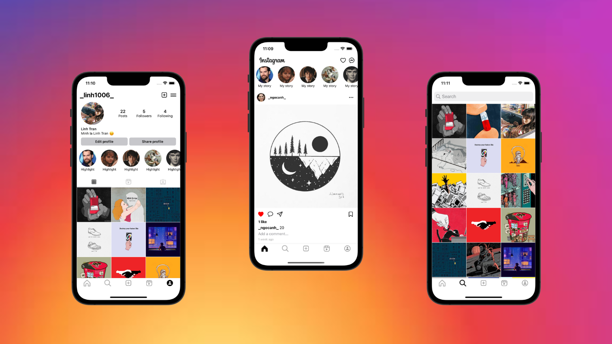
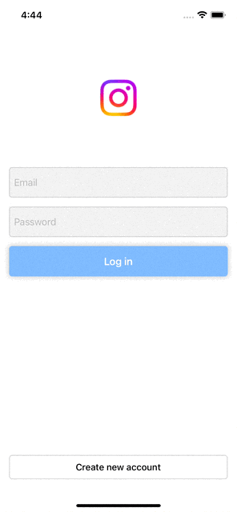
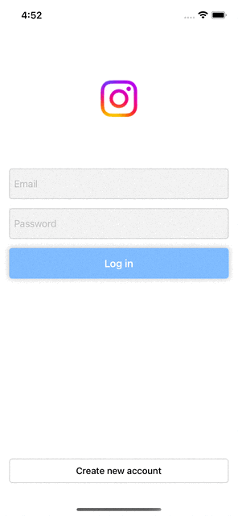
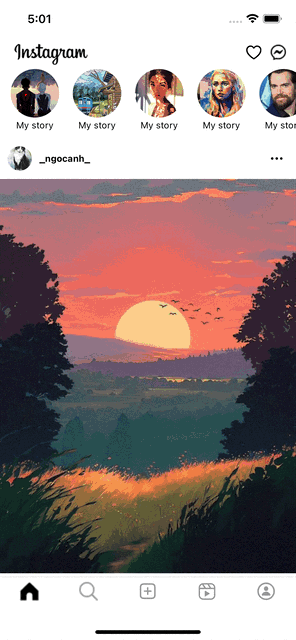
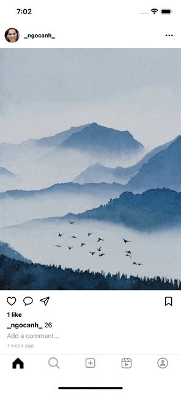
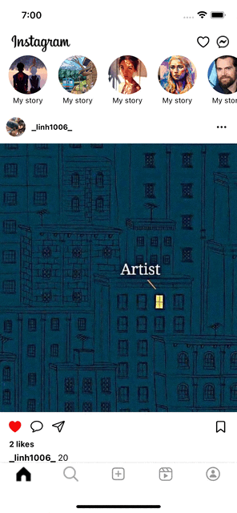
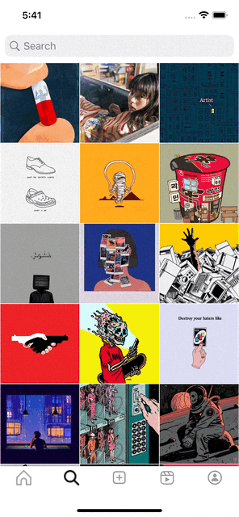
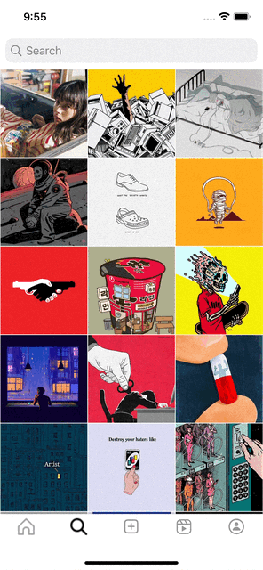
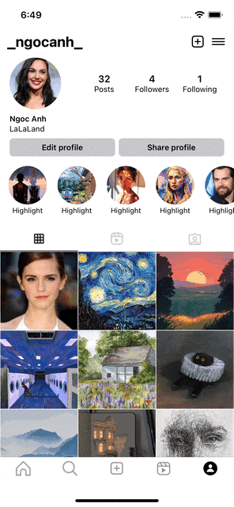
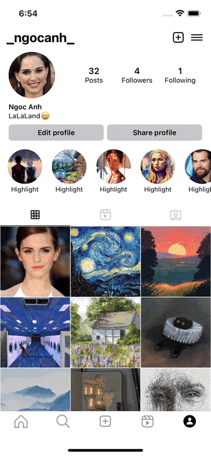

<!-- PROJECT LOGO -->
<br />
<div align="center">
  <a href="https://github.com/othneildrew/Best-README-Template">
    
  </a>

  <h3 align="center">Instagram Clone</h3>

  <p align="center">
    An Instagram clone app made with Swift and Firebase.
    <br />
    <a href="https://github.com/othneildrew/Best-README-Template"><strong>Explore the docs »</strong></a>
    <br />
    <br />
    <a href="https://github.com/othneildrew/Best-README-Template">View Demo</a>
    ·
    <a href="https://github.com/othneildrew/Best-README-Template/issues">Report Bug</a>
    ·
    <a href="https://github.com/othneildrew/Best-README-Template/issues">Request Feature</a>
  </p>
</div>

<!-- TABLE OF CONTENTS -->
<details>
  <summary>Table of Contents</summary>
  <ol>
    <li>
      <a href="#about-the-project">About The Project</a>
    </li>
    <li>
      <a href="#features">Features</a>
    </li>
    <li><a href="#preview">Preview</a></li>
    <li><a href="#installation">Installation</a></li>
    <li><a href="#upcoming features">Upcoming Features</a></li>
    <li><a href="#contact">Contact</a></li>
  </ol>
</details>

<!-- ABOUT THE PROJECT -->
## About The Project



This project is being developed for educational purpose and is still under development, I will continue to add more feartures to it.  

In this repository, I try my best to mimic the key features of the Instagram. I have utilized serveral frameworks and classes in order to create a complex UI and ehanced UX, which include:

- Architecture: 
  - MVVM
- UI: 
  - PhotoKit: Allow user to select image from their Photo Library.
  - UICollectionViewCompositionalLayout: To create a complex layout with multi section and various layout.
  - UIView animate: For smoother experience and transition.
- Database:
  - FirebaseAuth: Used for authenticating user.
  - FireStore: Used for storing and querying data of users and posts.
  - Storage: Used for storing user-generated content such as images.


<p align="right">(<a href="#readme-top">back to top</a>)</p>

<!-- Features -->
## Features

- Login and Signup Screen: 
  - Allow user to log in if they already have an account or create a new one.
- Home Screen:
  - View all posts from users that you are following.
  - Like post.
  - View all users who have liked the post.
  - View all comments on a post.
- Explore Screen:
  - Display all photos of user's posts excluding from your own posts.
  - Be able to search user based on usernames.
- Upload Post Screen:
  - Allow user to add photo to post from Library or Camera.
  - Post's caption is optional.
- Profile Screen:
  - Support both horizontal and vertical scrolling like Instagram. 
  - Be able to follow or unfollow user.
  - Be able to change user's info such as: fullname, username, bio and avatar.
- Support dark mode.

<p align="right">(<a href="#readme-top">back to top</a>)</p>

## Preview

- Login Screen

| Log in                       | Sign up                       |
| :--------------------------: | :---------------------------: |
|  |  |

- Home Screen

Self-sizing cell and remain photo aspect ratio.
Be able to load more comments.

| Home | Like | Comment | Other Profile |
| :---------: | :---------: | :------------: | :------------: |
|  |  |  |  |

- Explore Screen

| Explore | Search | Post Detail |
| :--------: | :--------: | :--------: |
|  |  |  |

- Upload Post 

| Upload post |
| :---------: |
|  |

- Profile Screen

| Profile | Edit Profile | Settings | Check Follow |
| :--------: | :--------: | :--------: | :--------: |
|  |  |  |  |

- Dark Mode:

| Dark Mode |
| :---------: |
|  |

<p align="right">(<a href="#readme-top">back to top</a>)</p>

## Installation

1. Clone the repo:

```sh
git clone https://github.com/ducanh2211/Instagram-Clone.git
cd Instagram-Clone/
```

2. Delete the following file and folder: `Podfile.lock`, `InstagramClone.xcworkspace` and `Pods`.

3. Install the dependencies through `CocoaPods` by run command:

``` sh
pod install
```

4. Set up [Firebase](https://firebase.google.com) project by following the instruction.
 
5. Delete file `GoogleService-Info.plist` and change the bundle Id.

<p align="right">(<a href="#readme-top">back to top</a>)</p>

## Upcoming Features

- Notifications for likes, comments, follow, etc.
- Add stories.
- Delete posts.
- One-to-one messages.

<p align="right">(<a href="#readme-top">back to top</a>)</p>

## Contact

- Email: ducanhtran221100@gmail.com
- Github: https://github.com/ducanh2211

<p align="right">(<a href="#readme-top">back to top</a>)</p>